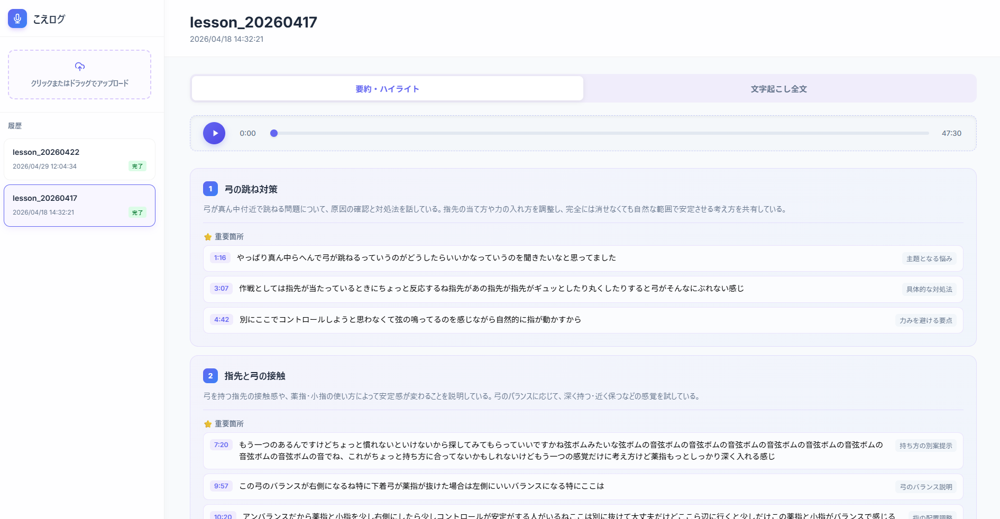

# こえログ

音声ファイルをアップロードするだけで、文字起こし・話者分離・要約を自動で行い、表示・再生するツールです。Notion への保存も同時に行います。

## デモ画面
バイオリンのレッスン音声の要約に使用している様子。


## 機能

- **文字起こし** — `faster-whisper` によるローカル処理
- **話者分離** — `pyannote.audio` で複数話者を自動識別
- **AI 要約** — OpenAI 互換 API でトピック・要約・ハイライトを抽出
- **Notion 連携** — 要約結果を Notion データベースへ自動保存
- **インタラクティブビューア** — タイムスタンプクリックで該当箇所を再生、処理進捗をリアルタイム表示
- **ステップ再試行** — 失敗したステップ（文字起こし・要約・Notion 出力）から個別に再実行可能

## 対応音声フォーマット

`.wav` / `.m4a` のみ対応しています。

## 技術スタック

| レイヤー | 使用技術 |
|---|---|
| Frontend | React / Vite / TypeScript |
| Backend | FastAPI (Python) |
| 文字起こし | faster-whisper (Whisper) |
| 話者分離 | pyannote.audio |
| 要約 | OpenAI API (互換) |

## セットアップ

### 必要条件

- Node.js & npm
- Docker（WSL 上で動作）
- Hugging Face トークン（pyannote モデル使用に必要）
- OpenAI 互換 API キー
- Notion API キーとデータベース ID

### 環境変数

`.env.example` をコピーして `.env` を作成し、各値を設定します。

```env
HF_TOKEN=hf_xxxxxxxxxxxxxxxxxxxxxxxxxxxxx

# LLM 設定
SUMMARIZE_BASE_URL=https://api.openai.com/v1
SUMMARIZE_API_KEY=your_api_key
SUMMARIZE_MODEL=gpt-4o

# Notion 設定
VOICE_PAGE_ID=your_notion_page_id
NOTION_API_KEY=your_notion_api_key
```

### 起動

**Windows（推奨）**

```bat
start.bat
```

初回実行時は `npm install` を自動で行います。2回目以降はセットアップをスキップして即座に起動します。バックエンド（Docker / ポート 8000）とフロントエンド（ポート 5173）を起動し、ブラウザを自動で開きます。

**手動起動**

```bash
# バックエンド（WSL 上で実行）
docker compose up --build
```

```bash
# フロントエンド（別ターミナル）
cd frontend
npm install
npm run dev
```

## 出力ファイル構成

処理結果は `backend/output/{folder_id}/` 以下に保存されます。

```
output/
└── {folder_id}/
    ├── status.json         # 各ステップの処理状態
    ├── transcription.json  # 文字起こし結果
    └── summary.json        # 要約結果
```
